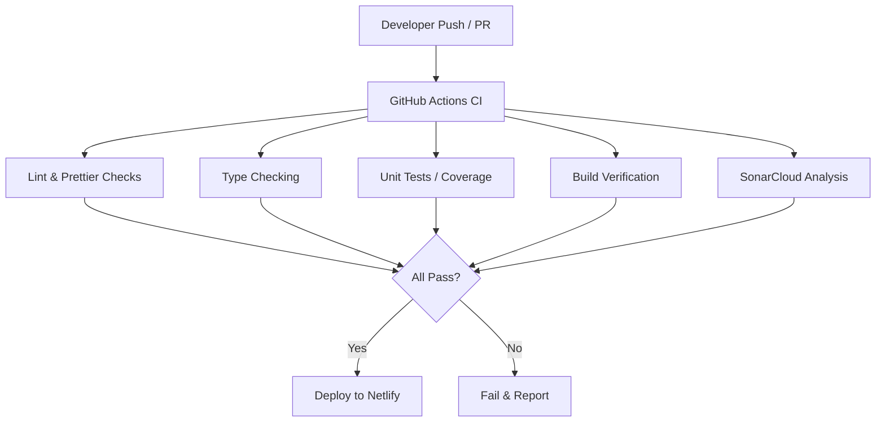

[⬅ Back to Root README](./README.md#documentation) | [Quickstart](./QUICKSTART.md)

# Contributing

## Pull requests checklist

- [] Branch created from `main` and named using conventions
  - (e.g. `feat/short-description`, `fix/short-description`).
- [] Commits are atomic and follow conventional commits
  - (e.g. `feat: add X`, `fix: correct Y`, `chore: update deps`).
- [] Local linting, formatting and TypeScript type checks passed:
  - `npm run lint`, `npm run format` and `npm run typecheck`.
- [] Unit and integration tests added or updated where applicable;
  - existing tests pass: `npm run test`.
- [] Build succeeds: - `npm run build`.
- [] Updated documentation or README if public behavior changed.
- [] Screenshots attached for UI changes.
- [] No secrets or credentials in the diff. Use GitHub Secrets or host secret stores.

> 💡 **Note**: Add short notes explaining the motivation and any migration steps needed for reviewer.

Thanks for contributing! See package-specific READMEs for details.

### Node ESM packages (NodeNext)

When authoring packages that export ES modules for use by apps in this monorepo, prefer Node's "NodeNext" module settings so emitted files use proper `.js` specifiers at runtime. Typical steps:

- Add `"type": "module"` to the package's `package.json` (if it only contains ESM).
- In the package `tsconfig.build.json` set `"module": "NodeNext"` and `"moduleResolution": "NodeNext"`.
- Use explicit `.js` specifiers in source entry points (e.g. `export * from './vite.shared.config.js'`) so the TypeScript emitter preserves correct import paths.

This ensures tools like Vite and Node can resolve local ESM imports reliably during dev and build.

