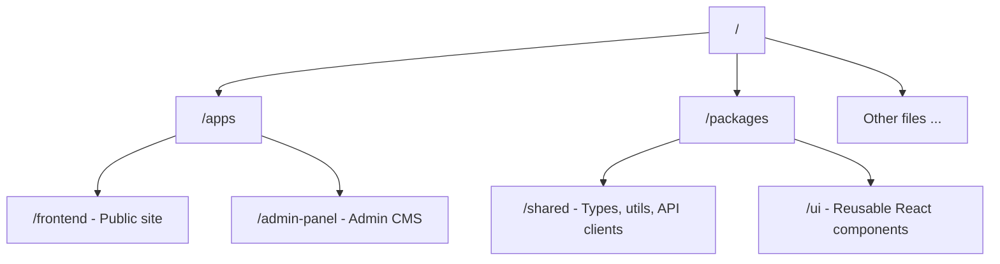
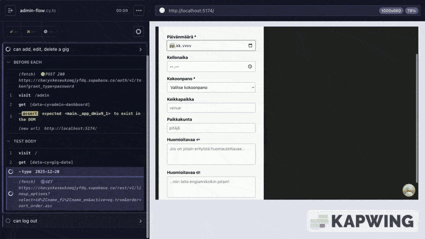
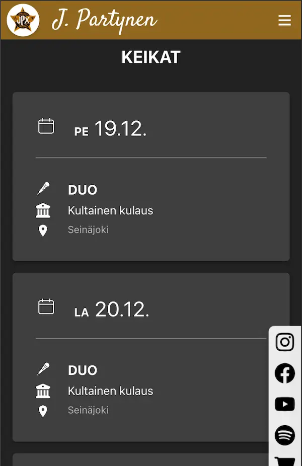
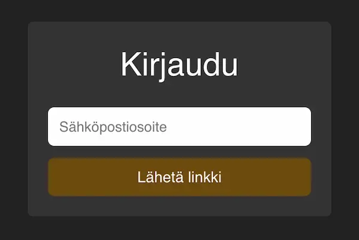
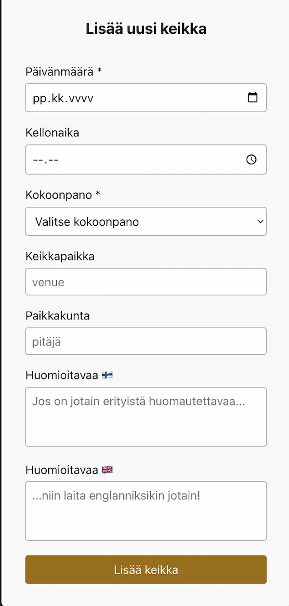
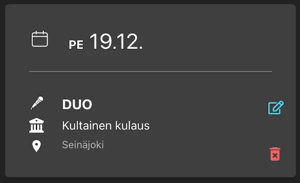
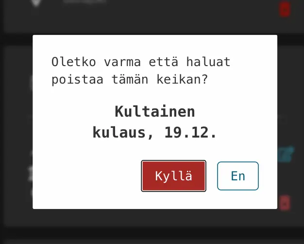
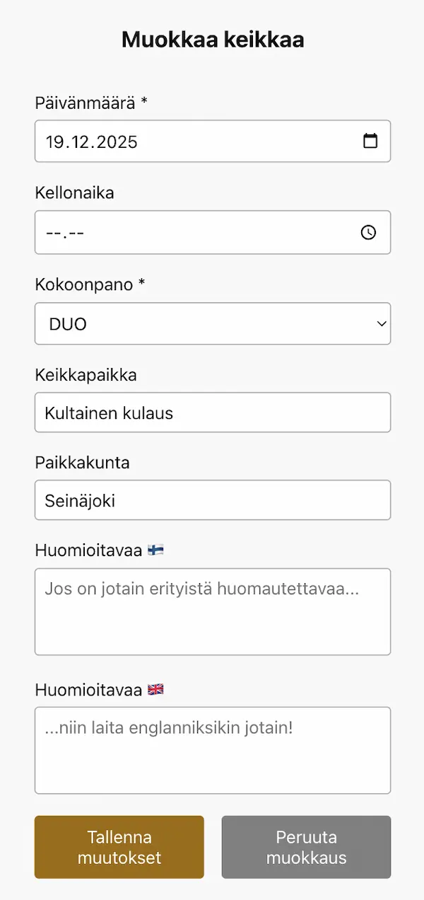
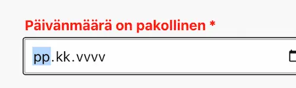

# J. Partynen ⭐ Artist Homepage

> A lightweight, cost-efficient artist website built with React and Supabase.  
> Designed for a single admin and low traffic, it includes a fast public site  
> and a simple, secure CMS for easy updates.

## 🚀 Live Demo

> **Public Artist Page**: https://jpartynen.com  
> **Admin Panel**: https://admin.jpartynen.com

### Desktop

### Mobile

## Documentation

- [Architecture](./docs/ARCHITECTURE.md)
- [CI/CD](./docs/CI-CD.md)
- [End-to-End Gig CRUD Lifecycle](docs/E2E-CRUD-FLOW.md)
- [Error Logging](./docs/ERROR-LOGGING.md)
- [I18N](./docs/I18N.md)
- [Pre-Hooks](./docs/PRE-HOOKS.md)
- [Tests](./docs/TESTS.md)

### Apps

- [Overview](./apps/README.md)
- [Frontend](./apps/frontend/README.md)
- [Admin Panel](./apps/admin-panel/README.md)

### Packages

- [Overview](./packages/README.md)
- [Shared](./packages/shared/README.md)
- [UI](./packages/ui/README.md)

## Table of Contents

- [Tech Stack](#tech-stack)
- [NPM Packages](#npm-packages)
- [Project Structure](#project-structure)
- [Features](#features)
- [UX Enhancements](#ux-enhancements)
- [Backend](#backend)
- [Code Quality](#code-quality)
- [Tests](#tests)
- [Error Handling and Logging](#error-handling-and-logging)
- [Screenshots](#screenshots)
- [Future Improvements](#future-improvements)
- [Licenses](#licenses)
- [Quickstart & Contributing](#quickstart--contributing)

## Tech Stack

| Layer            | Technology                                                     |
| ---------------- | -------------------------------------------------------------- |
| **Frontend**     | `Vite` • `React` • `TypeScript` • `CSS Modules`                |
| **Backend**      | `Supabase` (`Auth` + `Database with Row-Level Security (RLS)`) |
| **Database**     | `PostgreSQL`                                                   |
| **Deployment**   | `Netlify`                                                      |
| **Testing**      | `Vitest` • React Testing Library(planned) • `Cypress`          |
| **Code Quality** | `ESLint` • `Prettier` • `Husky + lint-staged`                  |
| **CI/CD**        | `GitHub Actions`                                               |

## NPM Packages

| Category               | Packages                                                                                      | Purpose                                                                              |
| ---------------------- | --------------------------------------------------------------------------------------------- | ------------------------------------------------------------------------------------ |
| **Monorepo & build**   | `turbo`, `npm workspaces`, `vite`                                                             | Monorepo orchestration and build tooling.                                            |
| **React & build**      | `react`, `react-dom` `typescript`                                                          | Core UI framework and build/tooling.                                                 |
| **Routing**            | `react-router-dom`                                                                            | Client-side routing for single-page apps.                                            |
| **Forms & validation** | `react-hook-form` `@hookform/resolvers` `zod`                                           | Form handling and schema validation.                                                 |
| **Data fetching**      | `@tanstack/react-query`                                                                       | Server data with caching.                                                            |
| **State management**   | `zustand`                                                                                     | Lightweight global state management for React.                                       |
| **Sanitization**       | `dompurify`                                                                                   | Sanitize user inputs to prevent XSS when rendering HTML.                             |
| **Localization**       | `i18next`, `react-i18next` `i18next-browser-languagedetector`                              | Translations and language detection.                                                 |
| **Backend**            | `@supabase/supabase-js`                                                                       | Auth + Postgres client used by the admin panel.                                      |
| **UI & utilities**     | `react-icons` `dayjs` `react-toastify`                                                  | Icons, date handling, toast notifications.                                           |
| **Monorepo packages**  | Local `/shared` and `/ui` packages                                                            | Shared api, data, schemas, global styles, types, utils and components for both apps. |
| **Dev & CI tooling**   | `eslint`, `prettier` `husky + lint-staged` `vitest` `@tanstack/react-query-devtools` | Linting, formatting, git hooks, tests, and developer tools.                          |

## Project Structure

See [ARCHITECTURE](./docs/ARCHITECTURE.md)

## Features

See [Frontend](./apps/frontend/README.md)

### Public Site

| Section            | Description                                                                                                            |
| ------------------ | ---------------------------------------------------------------------------------------------------------------------- |
| **Gigs**           | Browse:                                                                                                                |
|                    | upcoming gigs   load more `pagination`                                                                              |
| **Info & Contact** | View:                                                                                                                  |
|                    | band details   booking contacts                                                                                     |
| **Sidebar**        | Open:                                                                                                                  |
|                    | Social media `links`   Settings `modal`:   • `Toggle Theme:` Light / Dark mode   • `Switch Language:` FI / EN |

### Admin Panel (CMS)

See [Admin Panel](./apps/admin-panel/README.md)

| Feature             | Description                                                                   |
| ------------------- | ----------------------------------------------------------------------------- |
| **Authentication**  | Secure Supabase / Google OAuth `Login` ensuring only authorized admin access. |
| **Gigs Management** | Add, update and delete gig entries (dates, locations, details).               |
|                     | `Add` and `Edit` mode, `confirm delete modal` and `toast feedback`.           |

## UX Enhancements

- Responsive Design
- Accessibility (a11y)
- Performance Optimizations

## Backend

**Database:** PostgreSQL (via Supabase)

- Tables: `gigs`, `lineup_options`

**Authentication:** Google OAuth via Supabase

- Account access: Only the artist can log in; signups are disabled.

- Login flow:
  1. Click the Google icon on `/login`.
  2. Authenticate with Google credentials.
  3. Redirected to `/` with access to the protected admin panel.

> 💡 **Note**: This setup keeps the admin panel **simple, secure, and low-maintenance**.

## Code Quality

### Git Hooks

Pre-hooks ensure code quality at every step: fast formatting checks on pre-commit, and thorough type, test, and build verification on pre-push to guarantee safe, production-ready code.

See [Pre-Hooks](./docs/PRE-HOOKS.md)

### CI/CD Pipeline: **GitHub Actions**

Ensures a **consistent, high-quality codebase** with automated checks and deployments.

See [CI/CD](./docs/CI-CD.md)

## Tests

### Cypress E2E

**Admin Panel**

> **Login** → **Add** → **Edit** → **Delete** → **Confirm Delete** → **Logout**

See [Tests](./docs/TESTS.md)

## Error Handling and Logging

Covers **AppError propagation**, **client/server logging**, and **UI feedback** for all operations.

See [End-to-End Gig CRUD Lifecycle](./docs/E2E-CRUD-FLOW.md) and [Error Logging](./docs/ERROR-LOGGING.md)

## Screenshots

### Public site

**Gigs Section**

### CMS / Admin panel

**Login page**

**Add gig**

**Edit or delete**

**Confirm delete**

**Edit mode**

**Error notifications**

## Future Improvements

Future Add-Ons:

- Monitoring
  - Capture any errors returned from Supabase calls.
  - Send to Highlight with session context for reproduction.
  - Server-side (Supabase Edge Functions)
  - Log important warnings/errors using tslog or similar.
  - Only forward critical errors to Highlight, to avoid noise/costs.

- Testing
  - Unit tests (5–10): schemas and pure utilities in `packages/shared`.
  - Component tests (2–3): `GigForm` and `GigsTable` behavior in `apps/admin-panel`.
  - Optional: MSW for component tests to mock API responses.

- Security & Optimization
  - Harden the frontend (CSP, source maps) and backend (rate-limiting and possibly `x-request-id`).
  - Add automation: dependency updates, scanning, and basic observability.
  - Improve loading performance, and optimize API/database queries.
    - CDN layer: (artist promo materials, images)

- README
  - GIFs / Video demos

- Features
  - More diverse CMS:
    - Manage more content: (Text, and Drag & Drop promo materials, images)
    - Analytics dashboard

## Licenses

Creative content (images, text, artworks) is licensed under:

[Creative Commons Attribution-NoDerivatives 4.0 International (CC BY-ND 4.0)](CONTENT-LICENSE-CC_BY_ND_4.0.md)

Code is licensed separately under MIT (see [LICENSE](./LICENSE))

## Quickstart & Contributing

See [QUICKSTART](./docs/QUICKSTART.md) for a concise setup guide and [CONTRIBUTING](./CONTRIBUTING.md) for contribution guidelines.
