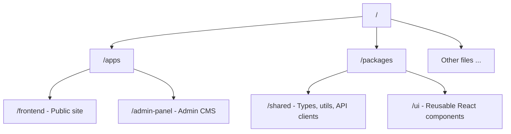

# J. Partynen ⭐ Artist Homepage


[](https://sonarcloud.io/summary/overall?id=aj-kivimaki_jpx)

> A lightweight, cost-efficient artist website built with React and Supabase.  
> Designed for a single admin and low traffic, it includes a fast public site  
> and a simple, secure CMS for easy updates.

## 🚀 Live Demo

> **Public Artist Page**: https://jpartynen.com  
> **Admin Panel**: https://admin.jpartynen.com

### Desktop


### Mobile


## Documentation

- [Architecture](./docs/ARCHITECTURE.md)
- [CI/CD](./docs/CI-CD.md)
- [Pre-Hooks](./docs/PRE-HOOKS.md)

### Apps

- [Overview](./apps/README.md)
- [Frontend](./apps/frontend/README.md)
- [Admin Panel](./apps/admin-panel/README.md)

### Packages

- [Overview](./packages/README.md)
- [Shared](./packages/shared/README.md)
- [UI](./packages/ui/README.md)

## Table of Contents

- [Tech Stack](#tech-stack)
- [NPM Packages](#npm-packages)
- [Project Structure](#project-structure)
- [Features](#features)
- [UX Enhancements](#ux-enhancements)
- [Backend](#backend)
- [Code Quality](#code-quality)
- [Screenshots](#screenshots)
- [Future Improvements](#future-improvements)
- [Licenses](#licenses)
- [Quickstart & Contributing](#quickstart--contributing)

## Tech Stack

| Layer            | Technology                                                |
| ---------------- | --------------------------------------------------------- |
| **Frontend**     | `Vite` • `React` • `TypeScript` • `CSS Modules`           |
| **Backend**      | `Supabase` (`Auth` + `Database with Row-Level Security`)  |
| **Database**     | `PostgreSQL`                                              |
| **Deployment**   | `Netlify`                                                 |
| **Testing**      | `Vitest` • `React Testing Library` • `Cypress/Playwright` |
| **Code Quality** | `ESLint` • `Prettier` • `Husky + lint-staged`             |
| **CI/CD**        | `GitHub Actions`                                          |

## NPM Packages

| Category               | Packages                                                         | Purpose                                                                              |
| ---------------------- | ---------------------------------------------------------------- | ------------------------------------------------------------------------------------ |
| **React & build**      | `react`, `react-dom`<br>`vite`, `typescript`                     | Core UI framework and build/tooling.                                                 |
| **Forms & validation** | `react-hook-form`<br>`@hookform/resolvers`<br>`zod`              | Form handling and schema validation.                                                 |
| **Data fetching**      | `react-query`                                                    | Server data with caching.                                                            |
| **Localization**       | `i18next`, `react-i18next`<br>`i18next-browser-languagedetector` | Translations and language detection.                                                 |
| **Backend**            | `@supabase/supabase-js`                                          | Auth + Postgres client used by the admin panel.                                      |
| **UI & utilities**     | `react-icons`<br>`dayjs`<br>`react-toastify`                     | Icons, date handling, toast notifications.                                           |
| **Monorepo packages**  | Local `/shared` and `/ui` packages                               | Shared api, data, schemas, global styles, types, utils and components for both apps. |
| **Dev & CI tooling**   | `eslint`, `prettier`<br>`husky + lint-staged`<br>`vitest`        | Linting, formatting, git hooks, tests.                                               |

## Project Structure

See [ARCHITECTURE](./docs/ARCHITECTURE.md)



## Features

See [Frontend](./apps/frontend/README.md)

### Public Site

| Section            | Description                                                                                       |
| ------------------ | ------------------------------------------------------------------------------------------------- |
| **Gigs**           | Browse                                                                                            |
|                    | • `upcoming gigs`                                                                                 |
| **Info & Contact** | View                                                                                              |
|                    | • `band details` <br> • `booking contacts`                                                        |
| **Sidebar**        | Settings & Links                                                                                  |
|                    | • `Social media links` <br> • `Theme: Toggle Light / Dark mode` <br> • `Language: Switch FI / EN` |

---

### Admin Panel (CMS)

See [Admin Panel](./apps/admin-panel/README.md)

| Feature             | Description                                                           |
| ------------------- | --------------------------------------------------------------------- |
| **Authentication**  | Secure Supabase `login` ensuring only authorized admin access.        |
| **Gigs Management** | `Add`, `update` and `delete` gig entries (dates, locations, details). |

---

## UX Enhancements

- Responsive Design
- Accessibility (a11y)
- Performance Optimizations

## Backend

**Database:** PostgreSQL (via Supabase)

- Tables: `gigs`, `lineup_options`


**Authentication:** Google OAuth via Supabase

- Account access: Only the artist can log in; signups are disabled.

- Login flow:
  1. Click the Google icon on `/login`.
  2. Authenticate with Google credentials.
  3. Redirected to `/` with access to the protected admin panel.

> 💡 **Note**: This setup keeps the admin panel **simple, secure, and low-maintenance**.

## Code Quality

### Git Hooks

Pre-hooks ensure code quality at every step: fast formatting checks on pre-commit, and thorough type, test, and build verification on pre-push to guarantee safe, production-ready code.

See [Pre-Hooks](./docs/PRE-HOOKS.md)

---

### CI/CD Pipeline: **GitHub Actions**

Ensures a **consistent, high-quality codebase** with automated checks and deployments.

See [CI/CD](./docs/CI-CD.md)

---

## Screenshots

### Public site

**Gigs Section**


### CMS / Admin panel

**Login page**


**Overview**


---

## Future Improvements

<details>
<summary>Future Add-Ons:</summary>

### Sooner:

```properties
- Form / Login Feedback and validation & error handeling
  - react-toastify for success/error messages
- Environment-Based Configuration (w/ zod schemas)
- Testing:
  - Component tests (React Testing Library)
  - E2E tests (Cypress/Playwright)
  - MSW API mocking
- Security
  - Rate limiting
  - ...
```

### Later:

```properties
- More diverse CMS: Manage more content (promo materials, images, text)
- CDN / image optimization layer: (artist promo materials)
- UI/UX Polish: Animations or micro-interactions (e.g., modals, sidebar transitions)
  - CSS, Framer motion?
- Monitoring & Analytics: Pageview/event tracking, uptime & performance
- Pre-render static pages: via Vite SSG
- Containerize: Docker
```

</details>

## Licenses

Creative content (images, text, artworks) is licensed under:

[Creative Commons Attribution-NoDerivatives 4.0 International (CC BY-ND 4.0)](CONTENT-LICENSE-CC_BY_ND_4.0.md)

Code is licensed separately under MIT (see [LICENSE](./LICENSE))

## Quickstart & Contributing

See [QUICKSTART](./docs/QUICKSTART.md) for a concise setup guide and [CONTRIBUTING](./CONTRIBUTING.md) for contribution guidelines.
