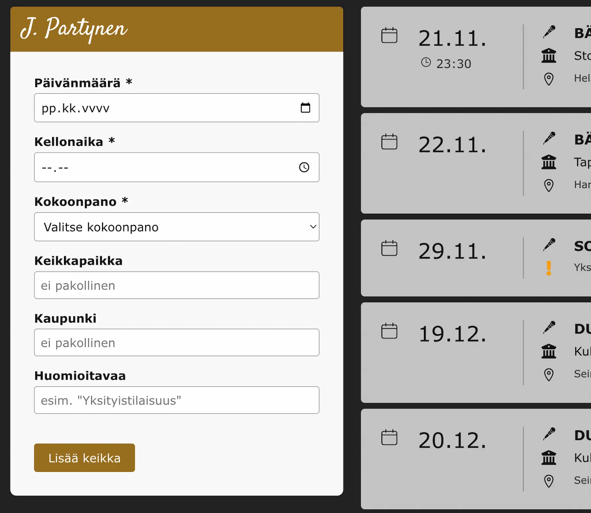

# J. Partynen ⭐ Artist Homepage


[](https://sonarcloud.io/summary/overall?id=aj-kivimaki_jpx)

> A lightweight, cost-efficient artist website built with React and Supabase.  
> Designed for a single admin and low traffic, it includes a fast public site  
> and a simple, secure CMS for easy updates.

## 🚀 Live Demo

> **Public Artist Page**: https://jpartynen.com  
> **Admin Panel**: https://admin.jpartynen.com

### DESKTOP


### MOBILE


## Table of Contents

- [Tech Stack](#tech-stack)
- [Project Structure](#project-structure)
- [Features](#features)
- [Backend](#backend)
- [Code Quality](#code-quality)
- [Screenshots](#screenshots)
- [Future Improvements](#future-improvements)
- [Licenses](#licenses)
- [Quickstart & Contributing](#quickstart--contributing)

## Tech Stack

| Layer            | Technology                                                |
| ---------------- | --------------------------------------------------------- |
| **Frontend**     | `Vite` • `React` • `TypeScript` • `CSS Modules`           |
| **Backend**      | `Supabase` (`Auth` + `Database with Row-Level Security`)  |
| **Database**     | `PostgreSQL`                                              |
| **Deployment**   | `Netlify`                                                 |
| **Testing**      | `Vitest` • `React Testing Library` • `Cypress/Playwright` |
| **Code Quality** | `ESLint` • `Prettier` • `Husky + lint-staged`             |
| **CI/CD**        | `GitHub Actions`                                          |

### Packages

| Category               | Packages                                                         | Purpose                                                                              |
| ---------------------- | ---------------------------------------------------------------- | ------------------------------------------------------------------------------------ |
| **React & build**      | `react`, `react-dom`<br>`vite`, `typescript`                     | Core UI framework and build/tooling.                                                 |
| **Forms & validation** | `react-hook-form`<br>`@hookform/resolvers`<br>`zod`              | Form handling and schema validation.                                                 |
| **Data fetching**      | `react-query`                                                    | Server data with caching.                                                            |
| **Localization**       | `i18next`, `react-i18next`<br>`i18next-browser-languagedetector` | Translations and language detection.                                                 |
| **Backend**            | `@supabase/supabase-js`                                          | Auth + Postgres client used by the admin panel.                                      |
| **UI & utilities**     | `react-icons`<br>`dayjs`<br>`react-toastify`                     | Icons, date handling, toast notifications.                                           |
| **Monorepo packages**  | Local `/shared` and `/ui` packages                               | Shared api, data, schemas, global styles, types, utils and components for both apps. |
| **Dev & CI tooling**   | `eslint`, `prettier`<br>`husky + lint-staged`<br>`vitest`        | Linting, formatting, git hooks, tests.                                               |

## Project Structure

<details>
<summary>File Tree</summary>

```text
  /.github
    /workflows      # GitHub Actions pipelines for apps and packages

  /.husky           # Git hooks for linting, formatting, typecheck, tests and build

  /apps
    /admin-panel
      /src
        /clients    # Supabase and React Query client
        /components
          /auth     # GoogleSignInButton, LogoutButton, PrivateRoute
          /form     # Form components for adding/editing gigs
          /gigs     # Gig display and management components
        /hooks      # Custom React hooks (useTostify)
        /pages      # Home, Login
    /frontend
      /src
        /clients    # Supabase and React Query client
        /components
          /gigs     # Public gigs list/table
          /info     # Band info section
          /language # LanguageSwitcher
          /layout   # Banner, Header, Footer
          /sidebar  # Social links, settings
          /theme    # ModeSwitcher
        /hooks      # Custom React hooks (useLocalized)
        /utils      # Helper functions (applyTheme)

  /packages
    /shared
      /src
        /api        # Data Access Layer
        /data       # Static/shared data
        /schemas    # Zod validation
        /styles     # CSS styles (reset, global)
        /types      # Types
        /utils      # Helper functions
    /ui
      /src
        /components # Shared components (GigCard.tsx)
```

</details>

## Features

### Public Site

| Section            | Description                                     |
| ------------------ | ----------------------------------------------- |
| **Gigs**           | Browse `upcoming gigs` (dates, locations, etc.) |
| **Info & Contact** | View `band details` and `booking contacts`.     |
| **Sidebar**        | Links and settings:                             |
|                    | • `Social media links`                          |
|                    | • `Theme – Toggle Light / Dark mode`            |
|                    | • `Language – Switch FI / EN`                   |

### Admin Panel (CMS)

| Feature             | Description                                                                     |
| ------------------- | ------------------------------------------------------------------------------- |
| **Authentication**  | `Secure Supabase login` for administrators, ensuring only authorized access.    |
| **Gigs Management** | `Add and delete gig entries` (dates, locations, details) via the CMS interface. |

> Shared `/shared` package ensures consistent schemas and types across the monorepo.

### UX Enhancements

- Responsive Design
- Accessibility (a11y)
- Performance Optimizations

## Backend

**Database:** PostgreSQL (via Supabase)

- Table: `gigs`

**Authentication:** Google OAuth via Supabase

- Account access: Only the artist can log in; signups are disabled.

- Login flow:
  1. Click the Google icon on `/login`.
  2. Authenticate with Google credentials.
  3. Redirected to `/` with access to the protected admin panel.

> This setup keeps the admin panel **simple, secure, and low-maintenance**.

## Code Quality

### Git Hooks

#### Pre-Commit:

- `eslint --fix` + `prettier --write` on staged files
- `tsc --noEmit` on .ts / .tsx

> Pre-commit with fast formatting checks, so all pushed code is consistent.

#### Pre-Push:

> Packages `must` be built before running typecheck for apps

- Full TypeScript type-check (`npm run typecheck`)
- All tests (`npm test`)
  - Unit
  - Code coverage
- Build verification (`npm run build`)

> Pre-push is thorough, ensuring code is safe and production-ready.

### CI/CD Pipeline: **GitHub Actions**

Runs on every PR or push to `main`

- Linting & formatting (ESLint + Prettier)
- Typecheck packages
- Build packages

> Packages `must` be built before running typecheck for apps

- Typecheck apps
- Unit tests
- Build all
- Code quality analysis (SonarCloud)
- Deploy to Netlify (on push to `main` only)

> Ensures a **consistent, high-quality codebase** with automated checks and deployments.

---

## Screenshots

### Public site

**Gigs Section**


### CMS / Admin panel

**Login page**


**Overview**



---

## Future Improvements

<details>
<summary>Future Add-Ons:</summary>

### Sooner:

```properties
- Edit gigs
- Form / Login Feedback and validation & error handeling
  - react-toastify for success/error messages
- Environment-Based Configuration (w/ zod schemas)
- Testing:
  - Component tests (React Testing Library)
  - E2E tests (Cypress/Playwright)
  - MSW API mocking
- Security
  - Rate limiting
  - ...
```

### Later:

```properties
- More diverse CMS: Manage more content (promo materials, images, text)
- CDN / image optimization layer: (artist promo materials)
- UI/UX Polish: Animations or micro-interactions (e.g., modals, sidebar transitions)
  - CSS, Framer motion?
- Monitoring & Analytics: Pageview/event tracking, uptime & performance
- Pre-render static pages: via Vite SSG
- Containerize: Docker
```

</details>

## Licenses

Creative content (images, text, artworks) is licensed under:

[Creative Commons Attribution-NoDerivatives 4.0 International (CC BY-ND 4.0)](CONTENT-LICENSE-CC_BY_ND_4.0.md)

Code is licensed separately under MIT (see [LICENSE](./LICENSE))

## Quickstart & Contributing

See [QUICKSTART.md](./QUICKSTART.md) for a concise setup guide and [CONTRIBUTING.md](./CONTRIBUTING.md) for contribution guidelines.
