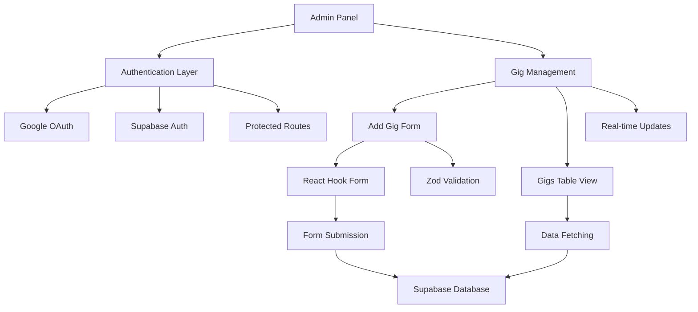

[⬅ Back to Root README](../../README.md#apps) | [Frontend](../frontend/README.md)

# Admin Panel | CMS `/admin-panel`

The admin panel is a secure content management system (CMS) for managing artist gigs and content. It provides authenticated administrators with tools to add, view, and manage upcoming performances.

## Features

### 🔐 Authentication

- **Google OAuth Integration**: Secure login using Google accounts
- **Protected Routes**: All admin functionality requires authentication
- **Single Admin Access**: Only the artist can access the admin panel

### 🎵 Gig Management

- **Add New Gigs**: Form-based interface for adding performances
- **View All Gigs**: Table display of all upcoming and past gigs
- **Real-time Updates**: Changes reflect immediately in the frontend

### 📝 Content Management Form

The gig creation form includes fields for:

- **Date & Time**: Performance scheduling
- **Lineup**: Artist/band name (Finnish & English)
- **Venue & City**: Location details
- **Notes**: Additional information (Finnish & English)

## Architecture



## Tech Stack

- **Frontend**: React + TypeScript + Vite
- **Forms**: React Hook Form + Zod validation
- **Styling**: CSS Modules
- **Data Fetching**: TanStack Query (React Query)
- **Backend**: Supabase (Auth + Database)
- **Icons**: React Icons

## Key Components

### Authentication Components

- `GoogleSignInButton`: Initiates Google OAuth flow
- `LogoutButton`: Signs out current admin user
- `PrivateRoute`: Protects admin routes from unauthorized access

### Form Components

- `Form`: Main gig creation form with validation
- `FormInput`: Reusable text input component
- `FormSelect`: Dropdown for predefined options

### Gig Management Components

- `Gigs`: Container component for gig management
- `GigsTable`: Displays gigs in tabular format

## Data Flow

1. **Authentication**: User signs in with Google OAuth
2. **Authorization**: Supabase validates admin access
3. **Data Loading**: Gigs fetched from Supabase on app load
4. **Form Submission**: New gigs validated and saved to database
5. **Real-time Sync**: UI updates immediately after changes
6. **Frontend Sync**: Public site reflects admin changes

## Security Features

- **Row Level Security**: Database-level access control
- **OAuth Only**: No password-based authentication
- **Session Management**: Automatic logout on session expiry
- **Input Validation**: Client and server-side validation
- **Type Safety**: Full TypeScript coverage

## Development

### Environment Setup

```bash
# Copy environment template
cp .env.example .env.local

# Required variables:
VITE_SUPABASE_URL=your_supabase_url
VITE_SUPABASE_ANON_KEY=your_supabase_anon_key
```

### Available Scripts

```bash
# Development server
npm run dev

# Build for production
npm run build

# Type checking
npm run typecheck

# Run tests
npm run test
```

## User Experience

### Admin Workflow

1. **Login**: Access admin panel via Google authentication
2. **Dashboard**: View existing gigs in organized table
3. **Add Content**: Use form to add new performances
4. **Review**: Verify information before submission
5. **Publish**: Changes appear immediately on public site

### Form Validation

- Real-time validation feedback
- Required field indicators
- Error messages for invalid inputs
- Zod schema validation for data integrity

## Integration Points

- **Shared Package**: Uses `@jpx/shared` for API functions and types
- **UI Package**: Imports reusable components from `@jpx/ui`
- **Frontend App**: Admin changes sync with public artist site
- **Supabase**: Centralized data storage and authentication
