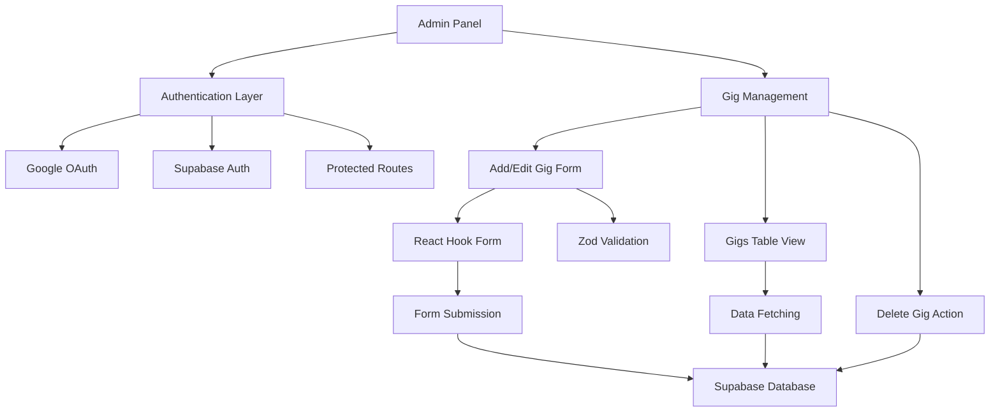

[⬅ Back to Root README](../../README.md#apps) | [Frontend](../frontend/README.md)

# Admin Panel | CMS `/admin-panel`

Secure CMS for managing artist gigs and content. Authenticated admin can add, edit, delete, view gigs.

## Features

- 🔐 **Authentication**: Google OAuth, protected routes, single-admin access
- 🎵 **Gig Management**: Add/edit/delete/view gigs
- 📝 **Content Form**: Date/Time, Lineup (FI/EN), Venue & City, Notes (FI/EN)

## Architecture



## Tech Stack

React + TypeScript + Vite | CSS Modules | React Hook Form + Zod | TanStack Query | Supabase | React Icons | `react-router-dom` | Turborepo + NPM Workspaces

## Key Components

- **Auth**: `GoogleSignInButton`, `LogoutButton`, `PrivateRoute`
- **Forms**: `Form`, `FormInput`, `FormSelect`
- **Gigs**: `Gigs`, `GigsTable`

## Data Flow

1. Google OAuth sign-in
2. Supabase validates admin access
3. Gigs fetched on load
4. Form submission saves gigs
5. UI updates in real-time

## Security

- Row-level security, OAuth-only login
- Session management, input validation, TypeScript coverage

## Development

```bash
# Setup
cp .env.example .env.local
# Env variables
VITE_SUPABASE_URL=your_supabase_url
VITE_SUPABASE_ANON_KEY=your_supabase_anon_key

# Scripts
npm run dev       # Dev server
npm run build     # Production build
npm run typecheck # Type checking
npm run test      # Run tests

# Install package
npm install _package_name_ --workspace=admin-panel
```

## User Workflow

1. Login via Google
2. View gigs in dashboard
3. Add gigs with form
4. Review & submit
5. Changes appear immediately

**Form Validation**: Real-time feedback, required fields, errors, Zod schema

## Integration

- Shared API/types: `@jpx/shared`
- Reusable UI: `@jpx/ui`
- Public frontend displays updated content after page reload
- Centralized Supabase backend
