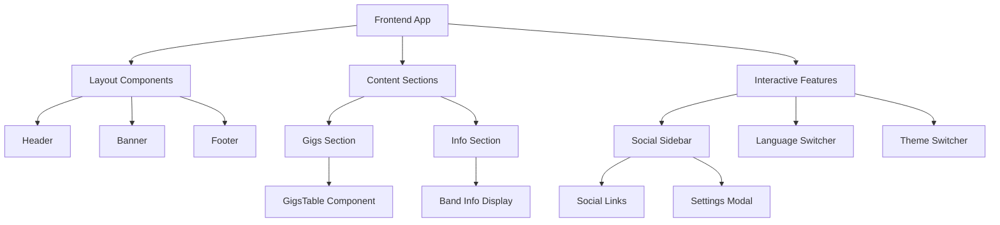

[⬅ Back to Root README](../../README.md#apps) | [Admin Panel](../admin-panel/README.md)

# Public Artist Site `/frontend`

The frontend is the public-facing website for J. Partynen, showcasing upcoming gigs, band information, and providing social media links. It's designed for optimal user experience with internationalization, responsive design, and accessibility features.

## Features

### 🎵 Gigs Section

- **Live Gig Listings**: Displays upcoming performances with dates, times, and venues
- **Real-time Updates**: Automatically syncs with admin panel changes
- **Responsive Tables**: Optimized display for desktop and mobile devices
- **Loading States**: User-friendly loading indicators during data fetch

### ℹ️ Info & Contact Section

- **Band Member Profiles**: Displays artist information with photos and roles
- **Contact Details**: Booking information and contact methods
- **Localized Content**: Bilingual support (Finnish/English)
- **Rich Media**: Band photos and promotional images

### 🔗 Social Sidebar

- **Social Media Links**: Direct links to Instagram, Facebook, YouTube, Spotify
- **Settings Panel**: Accessible modal with user preferences
- **Theme Toggle**: Light/dark mode switching
- **Language Switcher**: Finnish/English language selection

## Architecture



## Tech Stack

- **Frontend**: React + TypeScript + Vite
- **Styling**: CSS Modules for scoped component styles
- **Data Fetching**: TanStack Query (React Query) for server state
- **Routing**: `react-router-dom` for client-side routing
- **Data Fetching**: `@tanstack/react-query` for server state (use `@tanstack/react-query-devtools` during development)
- **Monorepo & Build**: `turbo`, `npm workspaces`, `vite`
- **Internationalization**: Custom i18n hook with Finnish/English support
- **Backend**: Supabase for data fetching
- **Icons**: React Icons for consistent iconography
- **Accessibility**: ARIA labels, semantic HTML, keyboard navigation

## Key Components

### Layout Components

- **Header**: Navigation and branding
- **Banner**: Hero section with promotional content
- **Footer**: Site footer with additional links

### Content Components

- **Gigs**: Main gigs display with table layout
- **GigsTable**: Responsive table component using GigCard components
- **Info**: Band information and contact details

### Interactive Components

- **Sidebar**: Social media links and settings access
- **LanguageSwitcher**: Bilingual language toggle
- **ModeSwitcher**: Theme switching (light/dark)
- **Modal**: Settings panel with accessibility features

## Data Flow

1. **Content Loading**: Static data (band info, social links) loaded from shared package
2. **Dynamic Data**: Gigs fetched from Supabase via React Query
3. **Localization**: Content translated based on user language preference
4. **Theme Application**: CSS custom properties updated for theme switching
5. **Real-time Sync**: Admin panel changes reflected immediately

## Internationalization

### Language Support

- **Finnish (FI)**: Primary language for local audience
- **English (EN)**: International accessibility
- **Persistent Settings**: Language preference saved in localStorage
- **Dynamic Switching**: Real-time content updates without page reload

### Content Localization

- **Static Content**: Band info, section titles, UI labels
- **Dynamic Content**: Gig information (lineup, venue, notes)
- **Date Formatting**: Localized date and time display
- **Accessibility**: Screen reader support in both languages

## Responsive Design

### Breakpoints

- **Mobile**: Single column layout, stacked components
- **Tablet**: Optimized spacing and typography
- **Desktop**: Multi-column layouts, full feature set

### Performance Optimizations

- **Lazy Loading**: Images loaded as needed
- **Code Splitting**: Route-based and component-based splitting
- **Caching**: React Query caching for gig data
- **Minimal Bundle**: Tree-shaken dependencies

## Accessibility Features

### WCAG Compliance

- **Semantic HTML**: Proper heading hierarchy and landmarks
- **ARIA Labels**: Screen reader support for interactive elements
- **Keyboard Navigation**: Full keyboard accessibility
- **Focus Management**: Visible focus indicators and logical tab order
- **Color Contrast**: High contrast ratios for readability
- **Alt Text**: Descriptive image alternatives

### User Experience

- **Loading States**: Clear feedback during data loading
- **Error Handling**: Graceful error messages and recovery
- **Progressive Enhancement**: Works without JavaScript (basic functionality)
- **Touch Targets**: Adequate button sizes for mobile interaction

## Development

### Environment Setup

```bash
# Copy environment template
cp .env.example .env.local

# Required variables:
VITE_SUPABASE_URL=your_supabase_url
VITE_SUPABASE_ANON_KEY=your_supabase_anon_key
```

### Available Scripts

```bash
# Development server with hot reload
npm run dev

# Production build
npm run build

# Preview production build
npm run preview

# Type checking
npm run typecheck

# Run tests
npm run test
```

## User Experience

### Navigation Flow

1. **Landing**: Hero banner with immediate visual impact
2. **Discovery**: Gigs section for upcoming shows
3. **Information**: Band details and contact information
4. **Connection**: Social media links for deeper engagement
5. **Personalization**: Language and theme preferences

### Performance Metrics

- **Fast Loading**: Optimized bundle size and loading strategies
- **Smooth Interactions**: React-based smooth state transitions
- **Mobile Optimized**: Touch-friendly interface elements
- **Offline Ready**: Service worker for basic offline functionality

## Integration Points

- **Shared Package**: Uses `@jpx/shared` for data, utilities, and API functions
- **UI Package**: Imports `GigCard` component from `@jpx/ui`
- **Admin Panel**: Receives real-time updates from CMS changes
- **Supabase**: Fetches gig data and static content
- **External Services**: Social media platforms and booking systems
