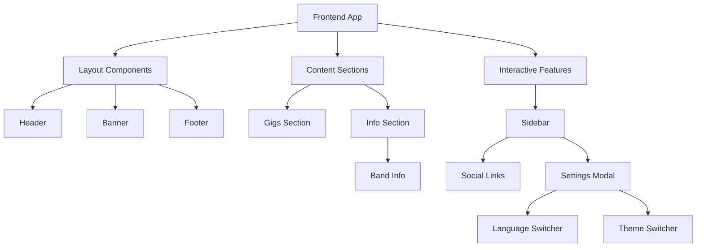

[⬅ Back to Root README](../../README.md#apps) | [Admin Panel](../admin-panel/README.md)

# Public Artist Site `/frontend`

Public-facing site for J. Partynen showcasing gigs, band info, and social links. Features internationalization, responsive design, and accessibility.

## Features

- **Gigs**: Live listings, responsive tables, loading indicators
- **Info & Contact**: Band profiles, booking info, bilingual content, images
- **Social Sidebar**: Links, settings modal, theme toggle, language switcher

## Architecture



## Tech Stack

| Frontend                  | Styling     | Data Fetching | Routing          | State/Monorepo             | Others                                              |
| ------------------------- | ----------- | ------------- | ---------------- | -------------------------- | --------------------------------------------------- |
| React + TypeScript + Vite | CSS Modules | React Query   | react-router-dom | Turborepo + NPM Workspaces | Supabase, React Icons, i18n, Accessibility features |

## Key Components

- **Layout**: Header, Banner, Footer
- **Content**: Gigs, GigsTable, Info
- **Interactive**: Sidebar, LanguageSwitcher, ModeSwitcher, Modal

## Data Flow

1. Static data from shared package
2. Gigs fetched from Supabase via React Query
3. Content translated per language setting
4. Theme updates applied via CSS variables

## Internationalization

- Languages: Finnish/English, preference saved in localStorage, dynamic switching without reload
- Localized static (UI) and dynamic (gig) content
- Date/time formatted per locale

## Responsive Design

- Mobile: Single-column, stacked components
- Tablet/Desktop: Optimized spacing and multi-column layouts
- Lazy loading, code splitting, React Query caching

## Accessibility & UX

- Semantic HTML, ARIA labels, keyboard navigation, focus indicators, high contrast, alt text
- Loading states, error handling, touch-friendly

## Development

```bash
cp .env.example .env.local
VITE_SUPABASE_URL=your_supabase_url
VITE_SUPABASE_ANON_KEY=your_supabase_anon_key

# From repository root (preferred)
npm run dev --workspace=frontend
npm run build --workspace=frontend
npm run preview --workspace=frontend
npm run typecheck --workspace=frontend
npm run test:unit --workspace=frontend

# Or run locally inside the package
npm install
npm run dev
```

## User Flow

Landing → Gigs → Band Info → Social Links → Theme/Language Preferences

## Integration

- Shared package: `@jpx/shared`
- UI components: `@jpx/ui` (`GigCard`)
- Config helpers: `@jpx/config` (shared Vite/Vitest helpers)
- Supabase: dynamic content
- External services: social media and booking agency
