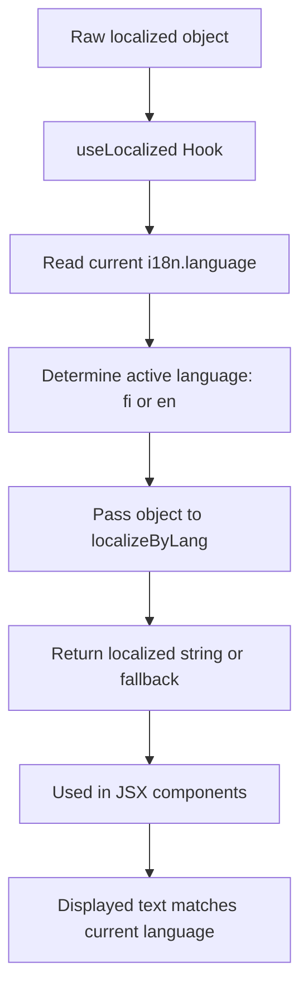

```mermaid
%% useLocalized Flow Diagram
flowchart TD
    A[Raw localized object] --> B[useLocalized Hook]
    B --> C[Read current i18n.language]
    C --> D[Determine active language: fi or en]
    D --> E[Pass object to localizeByLang]
    E --> F[Return localized string or fallback]
    F --> G[Used in JSX components]
    G --> H[Displayed text matches current language]
```
