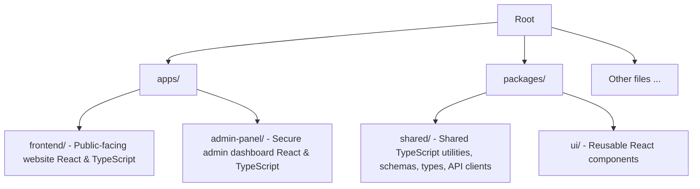

[⬅ Back to Root README](../README.md#documentation) | [CI/CD](./CI-CD.md) | [E2E-CRUD-Flow](./E2E-CRUD-FLOW.md) | [Error Logging](./ERROR-LOGGING.md) | [I18N](./I18N.md) | [PRE-HOOKS](./Pre-Hooks.md)

# 🏗️ Monorepo Architecture

> This project is a TypeScript-based full-stack monorepo organized using modern, production-grade architectural patterns. The codebase includes shared packages and independent applications (**frontend** and **admin** panel), while integrating with an external backend service (Supabase). This structure makes the project scalable, maintainable, and easy to reason about as it grows.



<details>
<summary>File Tree</summary>

```text
  /.github
    /workflows      # GitHub Actions pipelines for apps and packages

  /.husky           # Git hooks for linting, formatting, typecheck, tests and build

  /apps
    /admin-panel
      /src
        /clients    # Supabase and React Query client
        /components
          /auth     # GoogleSignInButton, LogoutButton, PrivateRoute
          /form     # Form components for adding/editing gigs
          /gigs     # Gig display and management components
        /hooks      # Custom React hooks (useTostify)
        /pages      # Home, Login
    /frontend
      /src
        /clients    # Supabase and React Query client
        /components
          /gigs     # Public gigs list/table
          /info     # Band info section
          /language # LanguageSwitcher
          /layout   # Banner, Header, Footer
          /sidebar  # Social links, settings
          /theme    # ModeSwitcher
        /hooks      # Custom React hooks (useLocalized)
        /utils      # Helper functions (applyTheme)

  /packages
    /shared
      /src
        /api        # Data Access Layer
        /data       # Static/shared data
        /schemas    # Zod validation
        /styles     # CSS styles (reset, global)
        /types      # Types
        /utils      # Helper functions
    /ui
      /src
        /components # Shared components (GigCard.tsx)
```

</details>

## 📦 Packages

### **`packages/shared`**

A workspace for shared logic across all apps, including:

- TypeScript types & DTOs
- Zod schemas for runtime validation
- API helpers / fetch wrappers
- Shared business logic utilities
- Shared static data

### **`packages/ui`**

A shared **UI component library** used by both the public site and the
admin panel, including:

- Shared React components

## 🧩 Applications

### **`apps/frontend` --- Public-Facing Site**

A user-facing website built with **React + TypeScript**, integrating:

- Supabase
- `packages/ui`
- `packages/shared`

### **`apps/admin-panel` --- Admin Dashboard**

An isolated admin interface with:

- Protected routes
- Operational tools

---

# 🎯 Why This Architecture?

- Clean separation of concerns
- Reusable package architecture
- Independent deployments
- Type-safe workflows
