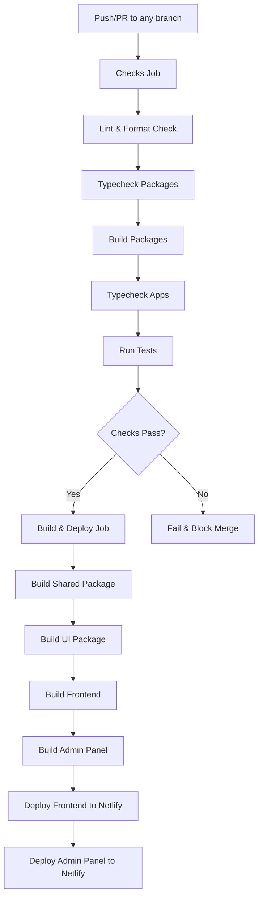

[⬅ Back to Root README](../README.md#documentation) | [Architecture](./ARCHITECTURE.md) | [Pre-Hooks](./PRE-HOOKS.md)

# CI/CD Pipeline

The project uses GitHub Actions for continuous integration and deployment, ensuring code quality and automated releases.

## Pipeline Overview

## GitHub Actions Workflow

### Triggers

- **Push to `main` branch**: Full pipeline including deployment
- **Pull Requests**: All checks run but no deployment

### Jobs

#### 1. Checks Job (Runs on all PRs and pushes)

**Environment Setup:**

- Ubuntu latest
- Node.js 22
- Clean install of dependencies

**Quality Gates:**

1. **Linting**: ESLint checks for code quality issues
2. **Formatting**: Prettier format validation
3. **Package Typecheck**: TypeScript validation for `@jpx/shared` and `@jpx/ui`
4. **Package Build**: Ensures packages can be built successfully
5. **App Typecheck**: TypeScript validation for `frontend` and `admin-panel`
6. **Unit Tests**: Runs test suite with coverage reporting

#### 2. Build & Deploy Job (Main branch only)

**Build Process:**

1. **Shared Package**: Builds TypeScript utilities and API functions
2. **UI Package**: Builds reusable React components
3. **Frontend App**: Production build with environment variables
4. **Admin Panel**: Production build with environment variables

**Deployment:**

- **Frontend**: Deploys to `jpartynen.com` via Netlify
- **Admin Panel**: Deploys to `admin.jpartynen.com` via Netlify

### Environment Variables

**Required Secrets:**

- `VITE_SUPABASE_URL`: Supabase project URL
- `VITE_SUPABASE_ANON_KEY`: Supabase public anonymous key
- `NETLIFY_AUTH_TOKEN`: Netlify authentication token
- `NETLIFY_SITE_ID`: Frontend Netlify site ID
- `ADMIN_NETLIFY_AUTH_TOKEN`: Admin panel Netlify token
- `ADMIN_NETLIFY_SITE_ID`: Admin panel Netlify site ID

### Build Dependencies

The monorepo structure requires specific build ordering:

1. **Packages must be built first** (`@jpx/shared`, `@jpx/ui`)
2. **Apps depend on packages** for TypeScript types and components
3. **Apps are built last** with production optimizations

### Code Quality Integration

- **SonarCloud**: Code quality analysis (configured but not shown in workflow)
- **Coverage Reports**: Generated during test runs
- **Type Safety**: Strict TypeScript checking across all packages

### Deployment Strategy

- **Staging**: All PRs run full checks but don't deploy
- **Production**: Only `main` branch pushes trigger deployment
- **Rollback**: Netlify supports instant rollbacks if needed
- **Preview**: Netlify generates deploy previews for PRs

### Performance & Reliability

- **Parallel Jobs**: Checks run in parallel where possible
- **Caching**: Dependencies are cached for faster builds
- **Fail Fast**: Pipeline stops on first failure
- **Clean Builds**: Fresh `node_modules` ensures consistency
