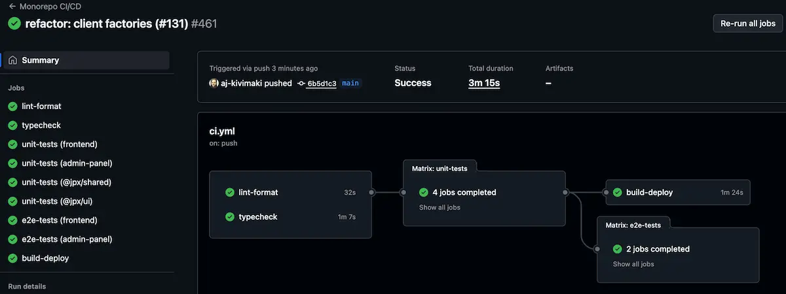

[⬅ Back to Root README](../README.md#documentation) | [Architecture](./ARCHITECTURE.md) | [E2E-CRUD-Flow](./E2E-CRUD-FLOW.md) | [Error Logging](./ERROR-LOGGING.md) | [I18N](./I18N.md) | [Pre-Hooks](./PRE-HOOKS.md) | [Tests](./TESTS.md)

# CI/CD Pipeline

The project uses GitHub Actions for continuous integration and deployment, ensuring code quality and automated releases.

## GitHub Actions Workflow

### Triggers

- **Push to `main` branch**: Full pipeline including deployment
- **Pull Requests**: All checks run but no deployment

### Jobs

#### 1. Checks (split across jobs)

- **`lint-format`**: ESLint checks and Prettier format validation (fast feedback on PRs).
- **`typecheck`**: Builds packages and runs TypeScript validation across packages and apps.
- **`unit-tests`**: Runs package/app unit tests using a workspace matrix (`frontend`, `admin-panel`, `@jpx/shared`, `@jpx/ui`, `@jpx/config`).
- **`e2e-tests`**: Runs Cypress E2E jobs per app (requires built artifacts and test secrets).

#### 2. Build & Deploy Job (Main branch only)

**Build Process:**

1. **Config Package**: (Optional) Validate shared Vite/Vitest helpers
2. **Shared Package**: Builds TypeScript utilities and API functions
3. **UI Package**: Builds reusable React components
4. **Frontend App**: Production build with environment variables
5. **Admin Panel**: Production build with environment variables

**Deployment:**

- **Frontend**: Deploys to `jpartynen.com` via Netlify
- **Admin Panel**: Deploys to `admin.jpartynen.com` via Netlify

### Environment Variables

**Required Secrets:**

- `VITE_SUPABASE_URL`: Supabase project URL
- `VITE_SUPABASE_ANON_KEY`: Supabase public anonymous key
- `NETLIFY_AUTH_TOKEN`: Netlify authentication token
- `NETLIFY_SITE_ID`: Frontend Netlify site ID
- `ADMIN_NETLIFY_AUTH_TOKEN`: Admin panel Netlify token
- `ADMIN_NETLIFY_SITE_ID`: Admin panel Netlify site ID

### Build Dependencies

The monorepo structure requires specific build ordering:

1. **Packages must be built first** (`@jpx/shared`, `@jpx/ui`, `@jpx/config`)
2. **Apps depend on packages** for TypeScript types and components
3. **Apps are built last** with production optimizations

### Code Quality Integration

- **SonarCloud**: Code quality analysis (configured but not shown in workflow)
- **Coverage Reports**: Generated during test runs
- **Type Safety**: Strict TypeScript checking across all packages

### Deployment Strategy

- **Staging**: All PRs run full checks but don't deploy
- **Production**: Only `main` branch pushes trigger deployment
- **Rollback**: Netlify supports instant rollbacks if needed
- **Preview**: Netlify generates deploy previews for PRs

### Performance & Reliability

- **Parallel Jobs**: Checks run in parallel where possible
- **Caching**: Dependencies are cached for faster builds
- **Fail Fast**: Pipeline stops on first failure
- **Clean Builds**: Fresh `node_modules` ensures consistency
