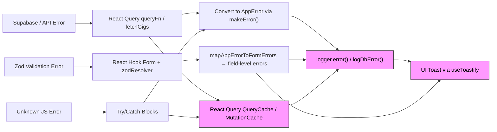
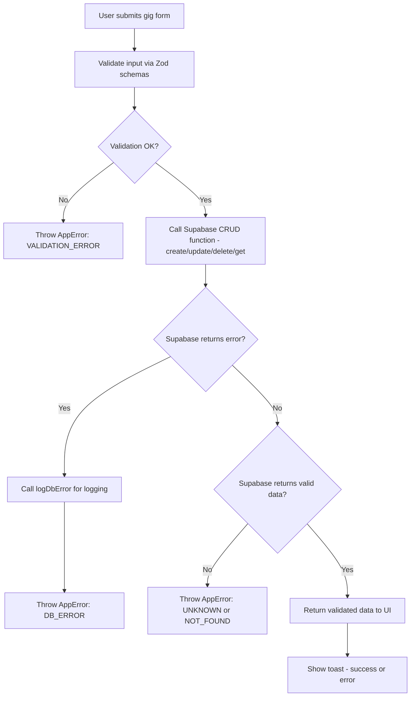
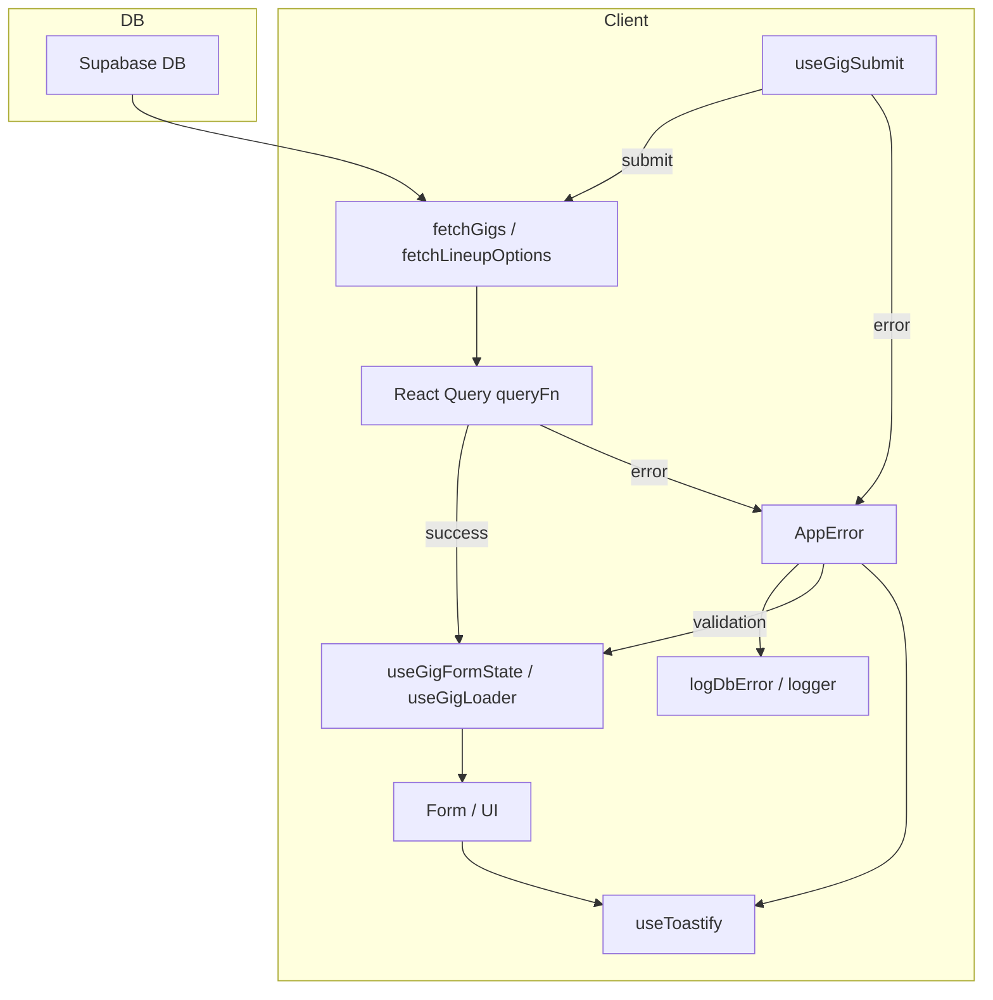
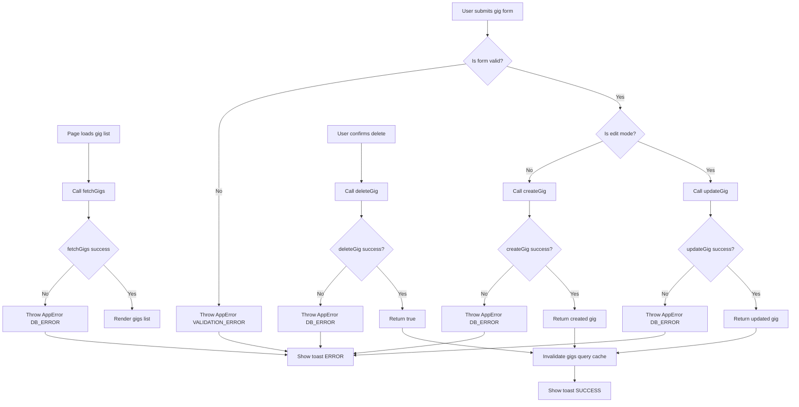

[⬅ Back to Root README](../README.md#documentation) | [Architecture](./ARCHITECTURE.md) | [CI/CD](./CI-CD.md) | [Error Logging](./ERROR-LOGGING.md) | [I18N](./I18N.md) | [Pre-Hooks](./PRE-HOOKS.md)

# End-to-End Gig CRUD Lifecycle Documentation

This document shows the complete lifecycle of Gig operations in the
app --- including:

- **loading**
- **creating**
- **updating**
- **deleting**
- **error handling**
- **logging**
- **React Query cache invalidation**
- **UI toast feedback**

---

## 1. App Error Propagation & Logging Flow

### Summary

This flow demonstrates how **all errors**---from Supabase, Zod, or
unknown JS exceptions---are normalized into `AppError`, logged, routed
into React Query's caches if appropriate, and surfaced to the user via
toasts or form field errors.

---

## 2. Gig Form Validation & Submission Flow

### Summary

This diagram illustrates how form submission moves through validation →
Supabase CRUD → error normalization → toast feedback. It also shows how
both validation and DB errors are handled consistently.

---

## 3. Client--Server Data Flow (React Query + Supabase)

### Summary

This diagram shows how gig data travels from Supabase through React
Query into UI components, and how errors propagate back upward to the
logger and toast notifications.

---

## 4. End-to-End Gig CRUD Lifecycle (Load, Create, Update, Delete)

### Summary

This final diagram integrates everything into a complete Gig CRUD
lifecycle:

- **List page loading**
- **Create & update via the form**
- **Delete via the confirmation modal**
- **Centralized error processing**
- **React Query cache invalidation**
- **Success/error toasts**

---

# Conclusion

Together, these diagrams form a complete system overview of **Gig CRUD
logic, error architecture, validation, logging, and UI feedback**.
