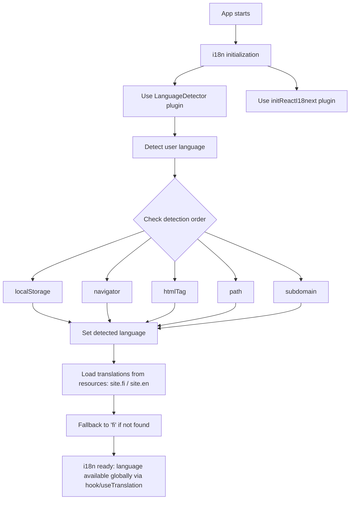

[⬅ Back to Root README](../README.md#documentation) | [Architecture](./ARCHITECTURE.md) | [CI/CD](./CI-CD.md) | [E2E-CRUD-Flow](./E2E-CRUD-FLOW.md) | [Error Logging](./ERROR-LOGGING.md) | [Pre-Hooks](./PRE-HOOKS.md) | [Tests](./TESTS.md)

