[⬅ Back to Root README](../README.md#documentation) | [Architecture](./ARCHITECTURE.md) | [CI/CD](./CI-CD.md) | [E2E-CRUD-Flow](./E2E-CRUD-FLOW.md) | [Error Logging](./ERROR-LOGGING.md) | [I18N](./I18N.md) | [Tests](./TESTS.md)

# Husky Hooks

> 💡 **Note**: Packages `must` be built before running typecheck for apps

### Pre-Commit

```mermaid
flowchart TD
    PreCommit["Pre-Commit Hook"] --> SecretScan["secret-scan.sh (repository secrets scan)"]
    PreCommit --> LintStaged["lint-staged → runs eslint --fix + prettier --write on staged files"]

    %% Notes
    PreCommit --- Note1["Runs a secret scan, then lint-staged for quick formatting & lint fixes"]
```

---

### Pre-Push

