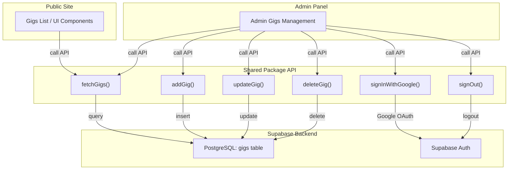
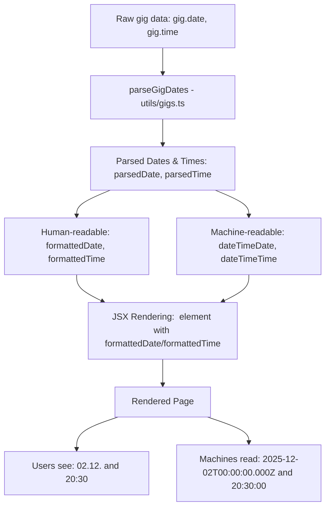

[⬅ Back to Root README](../../README.md#packages) | [UI](../ui/README.md)

# `/shared` Package

The shared package provides common utilities, types, schemas, and API functions used across both the frontend and admin-panel applications.

## API Reference

### Authentication Functions

#### `googleSignIn(client: SupabaseClient): Promise<void>`

Initiates Google OAuth sign-in flow using Supabase Auth.

```typescript
import { googleSignIn } from '@jpx/shared';
import { supabaseClient } from './clients/supabaseClient';

await googleSignIn(supabaseClient);
```

#### `signOut(client: SupabaseClient): Promise<void>`

Signs out the current user from Supabase Auth.

```typescript
import { signOut } from '@jpx/shared';

await signOut(supabaseClient);
```

### Gigs API Functions

#### `fetchGigs(client: SupabaseClient): Promise<DbGig[]>`

Fetches all gigs from the database, ordered by date.

```typescript
import { fetchGigs } from '@jpx/shared';

const gigs = await fetchGigs(supabaseClient);
// Returns: DbGig[]
```

#### `addGig(client: SupabaseClient, gig: NewGig): Promise<DbGig[]>`

Adds a new gig to the database.

```typescript
import { addGig, type NewGig } from '@jpx/shared';

const newGig: NewGig = {
  date: '2025-12-02',
  lineup_fi: 'Artist Name',
  lineup_en: 'Artist Name',
  venue: 'Venue Name',
  city: 'City Name',
  notes_fi: null,
  notes_en: null,
  time: '20:30:00',
};

const addedGigs = await addGig(supabaseClient, newGig);
```

#### `updateGig(client: SupabaseClient, gig: DbGig): Promise<DbGig[]>`

Updates an existing gig in the database.

```typescript
import { updateGig } from '@jpx/shared';

const updatedGig = await updateGig(supabaseClient, {
  id: 'gig-uuid',
  // ... other gig properties
});
```

#### `deleteGig(client: SupabaseClient, id: string): Promise<void>`

Deletes a gig from the database by ID.

```typescript
import { deleteGig } from '@jpx/shared';

await deleteGig(supabaseClient, 'gig-uuid');
```

## Data Types

### `DbGig`

Database representation of a gig with all fields.

```typescript
interface DbGig {
  id: string; // UUID
  date: string; // Date string (YYYY-MM-DD)
  lineup_fi: string; // Finnish lineup
  lineup_en: string; // English lineup
  venue: string | null; // Venue name
  city: string | null; // City name
  notes_fi: string | null; // Finnish notes
  notes_en: string | null; // English notes
  time: string | null; // Time string (HH:mm:ss)
}
```

### `NewGig`

Type for creating new gigs (excludes auto-generated `id`).

```typescript
type NewGig = Omit<DbGig, 'id'>;
```

### `ParsedGig`

Extended gig type with parsed and formatted date/time fields.

```typescript
interface ParsedGig extends DbGig {
  parsedDate?: Dayjs;
  parsedTime?: Dayjs;
  formattedDate?: string; // e.g., "02.12."
  formattedTime?: string; // e.g., "20:30"
  dateTimeDate?: string; // ISO string
  dateTimeTime?: string; // e.g., "20:30:00"
}
```

## Utility Functions

### `parseGigDates(gig: DbGig): ParsedGig`

Parses raw gig date and time strings into formatted and machine-readable formats.

```typescript
import { parseGigDates } from '@jpx/shared';

const gig = {
  id: '1',
  date: '2025-12-02',
  time: '20:30:00',
  // ... other fields
};

const parsed = parseGigDates(gig);
// Returns ParsedGig with formattedDate: "02.12.", formattedTime: "20:30", etc.
```

## Static Data

The package exports validated static data objects:

- `band: Band` - Band information
- `contact: Contact` - Contact details
- `nav: Nav` - Navigation configuration
- `site: Site` - Site-wide settings
- `social: Social` - Social media links
- `ui: UIConfig` - UI configuration

```typescript
import { band, contact, social } from '@jpx/shared';
```

## Validation Schemas

Zod schemas for runtime validation:

- `DbGigSchema` - Validates gig database objects
- `GigsFormSchema` - Validates arrays of gigs for forms

```typescript
import { DbGigSchema } from '@jpx/shared';

const isValid = DbGigSchema.safeParse(someGigData);
```

## API



## GIGS


