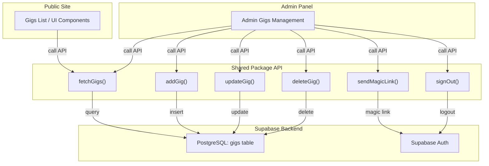

# API Layer Abstractions

```mermaid
flowchart TD
  subgraph Frontend["Public Site"]
    FE["Gigs List / UI Components"]
  end

  subgraph Admin["Admin Panel"]
    AD["Admin Gigs Management"]
  end

  subgraph Shared["Shared Package API"]
    API1["fetchGigs()"]
    API2["addGig()"]
    API3["updateGig()"]
    API4["deleteGig()"]
    API5["sendMagicLink()"]
    API6["signOut()"]
  end

  subgraph Backend["Supabase Backend"]
    DB["PostgreSQL: gigs table"]
    AUTH["Supabase Auth"]
  end

  FE -->|call API| API1
  AD -->|call API| API1
  AD -->|call API| API2
  AD -->|call API| API3
  AD -->|call API| API4
  AD -->|call API| API5
  AD -->|call API| API6

  API1 -->|query| DB
  API2 -->|insert| DB
  API3 -->|update| DB
  API4 -->|delete| DB
  API5 -->|magic link| AUTH
  API6 -->|logout| AUTH
```
