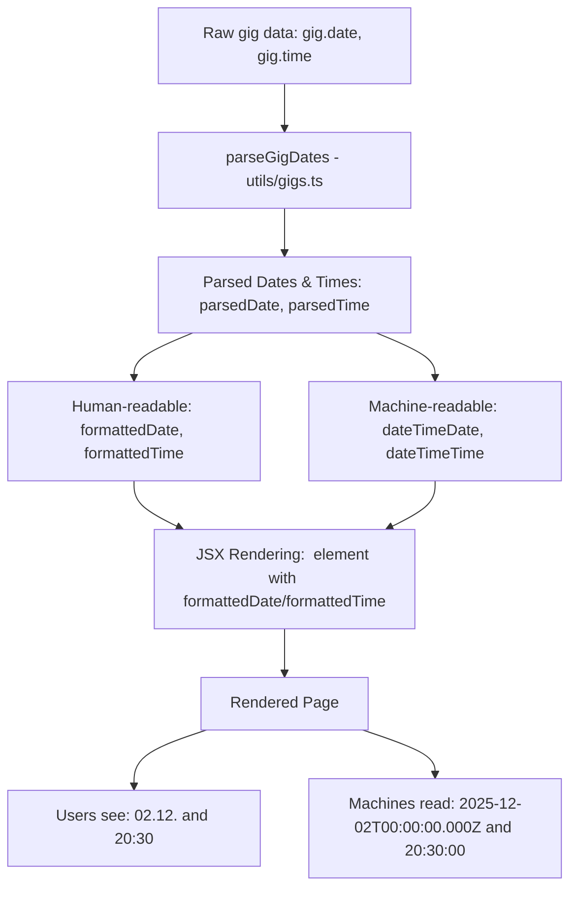

```mermaid
flowchart TD
    A[Raw gig data: gig.date, gig.time] --> B[parseGigDates - utils/gigs.ts]
    B --> C[Parsed Dates & Times: parsedDate, parsedTime]
    C --> D[Human-readable: formattedDate, formattedTime]
    C --> E[Machine-readable: dateTimeDate, dateTimeTime]
    D --> F[JSX Rendering: <time> element with formattedDate/formattedTime]
    E --> F
    F --> G[Rendered Page]
    G --> H[Users see: 02.12. and 20:30]
    G --> I[Machines read: 2025-12-02T00:00:00.000Z and 20:30:00]
```
