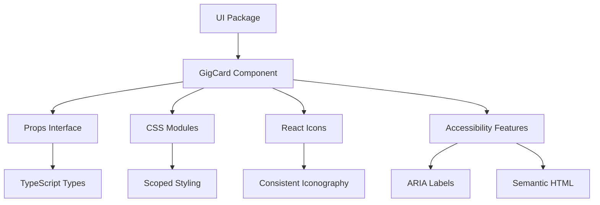

[⬅ Back to Root README](../../README.md#packages) | [Shared](../shared/README.md)

# `/ui` Package

The UI package provides reusable React components and styling utilities shared across the monorepo applications. It contains pre-built, accessible components that maintain consistent design and behavior.

## Components

### GigCard

A versatile card component for displaying gig information with optional admin controls.

#### Features

- **Responsive Design**: Adapts to different screen sizes
- **Accessibility**: Proper ARIA labels and semantic HTML
- **Internationalization Ready**: Supports bilingual content
- **Admin Controls**: Optional edit/delete buttons for admin interfaces
- **Rich Metadata**: Structured data with proper time elements

#### Props

```typescript
interface GigCardProps {
  id: string;
  formattedDate?: string; // e.g., "02.12."
  formattedTime?: string; // e.g., "20:30"
  dateTimeDate?: string; // ISO date string for <time> element
  dateTimeTime?: string; // Time string for <time> element
  lineup?: string; // Artist/band name
  venue?: string; // Venue name
  city?: string; // City name
  notes?: string; // Additional notes
  onDelete?: (id: string, venue: string, formattedDate: string) => void;
  onEdit?: (id: string) => void;
}
```

#### Usage Examples

**Public Display (Read-only):**

```tsx
import { GigsCard } from '@jpx/ui';

<GigsCard
  id="gig-123"
  formattedDate="02.12."
  formattedTime="20:30"
  dateTimeDate="2025-12-02T00:00:00.000Z"
  lineup="Artist Name"
  venue="Venue Name"
  city="Helsinki"
  notes="Special acoustic set"
/>;
```

**Admin Interface (with controls):**

```tsx
<GigsCard
  id="gig-123"
  formattedDate="02.12."
  formattedTime="20:30"
  lineup="Artist Name"
  venue="Venue Name"
  city="Helsinki"
  onDelete={(id, venue, date) => handleDelete(id, venue, date)}
  onEdit={(id) => handleEdit(id)}
/>
```

#### Visual Structure

```
┌─────────────────────────────────────┐
│ ┌─────────┐ ┌─────────────────────┐ │
│ │ Date    │ │ Lineup: Artist Name  │ │
│ │ 02.12.  │ │ Venue: Venue Name    │ │
│ │         │ │ City: Helsinki       │ │
│ │ Time    │ │ Notes: Special show  │ │
│ │ 20:30   │ └─────────────────────┘ │
│ └─────────┘                         │
│    [Edit] [Delete]  ← Admin controls │
└─────────────────────────────────────┘
```

## Design System

### Styling Approach

- **CSS Modules**: Scoped styling to prevent conflicts
- **Responsive**: Mobile-first design principles
- **Accessible**: High contrast ratios and focus indicators
- **Consistent**: Shared design tokens and spacing

### Icon System

- **React Icons**: Consistent icon library across components
- **Semantic**: Icons convey meaning and improve UX
- **Accessible**: Hidden from screen readers where decorative

### Typography

- **Structured Content**: Proper heading hierarchy
- **Readable**: Optimized font sizes and line heights
- **International**: Supports multiple character sets

## Architecture



## Development

### Building the Package

```bash
cd packages/ui

# Install dependencies
npm install

# Development build with watching
npm run dev

# Production build
npm run build

# Type checking
npm run typecheck
```

### Adding New Components

1. Create component in `src/components/`
2. Add CSS Modules for styling
3. Export from `src/index.ts`
4. Update this README with documentation
5. Ensure TypeScript types are exported

### Design Guidelines

- **Component Naming**: PascalCase for component files
- **Props Interface**: Define clear TypeScript interfaces
- **CSS Classes**: Use descriptive, semantic class names
- **Accessibility**: Include ARIA labels and keyboard navigation
- **Responsive**: Test on multiple screen sizes

## Integration

### Importing Components

```typescript
// Individual component
import { GigsCard } from '@jpx/ui';

// Or import all components
import * as UI from '@jpx/ui';
```

### Dependencies

- **React**: ^18.0.0
- **React Icons**: For icon components
- **TypeScript**: For type safety
- **CSS Modules**: For scoped styling

### Peer Dependencies

- **React DOM**: For rendering components
- **Shared Package**: For common types and utilities

## Future Components

Potential additions to the UI package:

- **Button**: Consistent button styles and variants
- **Modal**: Reusable modal/dialog component
- **Form Elements**: Standardized form inputs and selects
- **Layout Components**: Grid, flexbox utilities
- **Notification**: Toast messages and alerts
