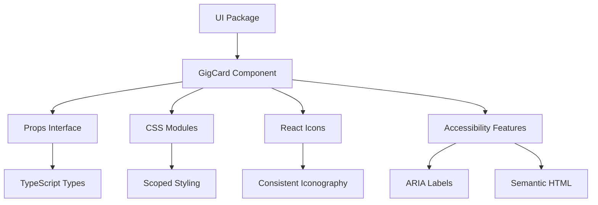

[⬅ Back to Root README](../../README.md#packages) | [Shared](../shared/README.md) | [Config](../config/README.md)

# `/ui` Package

The UI package provides reusable React components and styling utilities shared across the monorepo applications. It contains pre-built, accessible components that maintain consistent design and behavior.

## Components

### GigCard (exported)

A versatile card component (implemented in `src/components/GigCard.tsx`) exported from the package as `GigCard`. It displays gig information with optional admin controls.

#### Features

- **Responsive Design**: Adapts to different screen sizes
- **Accessibility**: Proper ARIA labels and semantic HTML
- **Internationalization Ready**: Supports bilingual content
- **Admin Controls**: Optional edit/delete buttons for admin interfaces
- **Rich Metadata**: Structured data with proper time elements

#### Props

```typescript
interface GigCardProps {
  id: string;
  formattedDate?: string; // e.g., "02.12."
  formattedTime?: string; // e.g., "20:30"
  dateTimeDate?: string; // ISO date string for <time> element
  dateTimeTime?: string; // Time string for <time> element
  lineup?: string; // From solo to full band
  venue?: string; // Venue name
  city?: string; // City name
  notes?: string; // Additional notes
  onDelete?: (id: string, venue: string, formattedDate: string) => void;
  onEdit?: (id: string) => void;
}
```

#### Usage Examples

**Public Display (Read-only):**

```tsx
import { GigCard } from '@jpx/ui';

<GigCard
  id="gig-123"
  formattedDate="02.12."
  formattedTime="20:30"
  dateTimeDate="2025-12-02T00:00:00.000Z"
  lineup="Band"
  venue="Venue Name"
  city="Helsinki"
  notes="Special acoustic set"
/>;
```

**Admin Interface (with controls):**

```tsx
<GigCard
  id="gig-123"
  formattedDate="02.12."
  formattedTime="20:30"
  lineup="Band"
  venue="Venue Name"
  city="Helsinki"
  onDelete={(id, venue, date) => handleDelete(id, venue, date)}
  onEdit={(id) => handleEdit(id)}
/>
```

## Design System

### Styling Approach

- **CSS Modules**: Scoped styling to prevent conflicts
- **Responsive**: Mobile-first design principles
- **Accessible**: High contrast ratios and focus indicators
- **Consistent**: Shared design tokens and spacing

### Icon System

- **React Icons**: Consistent icon library across components
- **Semantic**: Icons convey meaning and improve UX
- **Accessible**: Hidden from screen readers where decorative

### Typography

- **Structured Content**: Proper heading hierarchy
- **Readable**: Optimized font sizes and line heights
- **International**: Supports multiple character sets

## Architecture



## Development

### Building the Package

```bash
cd packages/ui

# Install dependencies (from repository root prefered)
npm install

# Build package for consumption by apps
npm run build

# Run unit tests for the package
npm run test:unit

# Type checking
npm run typecheck
```

Note: there is no package-local `dev` script. During active app development, run the consuming application's dev server (for example `npm run dev --workspace=frontend`) so the app can import local packages. To iterate on UI components in isolation, build the package and reload the consuming app.

### Adding New Components

1. Create component in `src/components/`
2. Add CSS Modules for styling
3. Export from `src/index.ts`
4. Update this README with documentation
5. Ensure TypeScript types are exported

### Design Guidelines

- **Component Naming**: PascalCase for component files
- **Props Interface**: Define clear TypeScript interfaces
- **CSS Classes**: Use descriptive, semantic class names
- **Accessibility**: Include ARIA labels and keyboard navigation
- **Responsive**: Test on multiple screen sizes

## Integration

### Importing Components

```typescript
// Individual component
import { GigCard } from '@jpx/ui';

// Or import all components
import * as UI from '@jpx/ui';
```

### Dependencies

- **react-icons**
- **TypeScript**: for development (see devDependencies)
- **CSS Modules**: for scoped styling

### Peer Dependencies

- **react**
- **react-dom**
- **Shared Package**: for common types/utilities (`@jpx/shared`)
- **Config**: optional shared build/test configs (`@jpx/config`)
